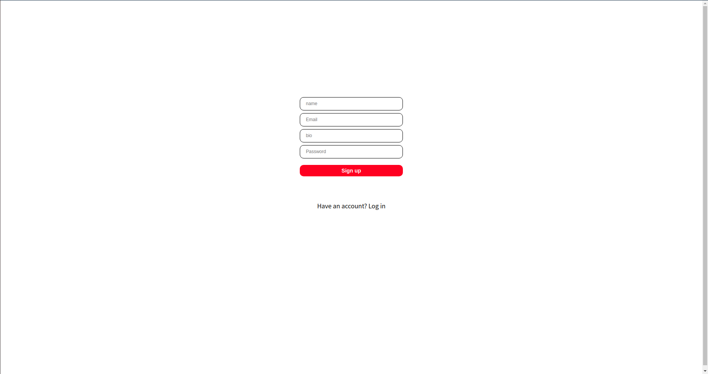
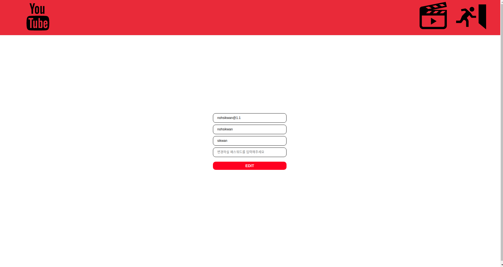
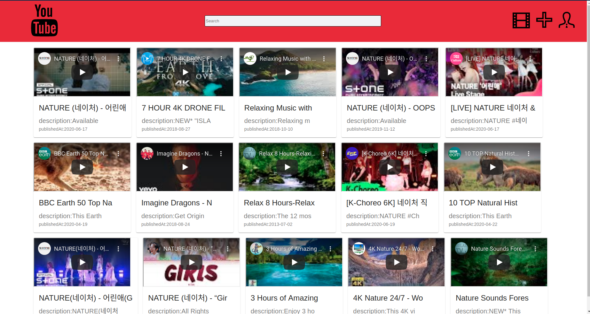
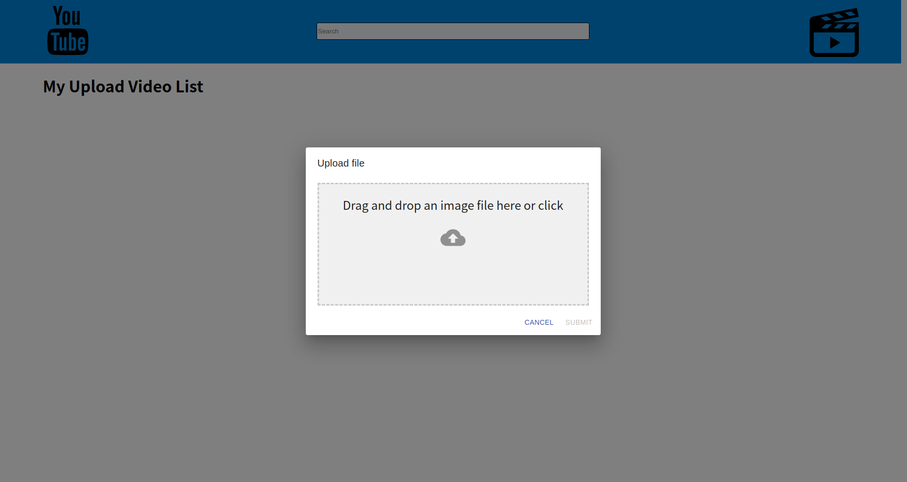

# Youtube Clone

#### Install

```js
$ npm(yarn) install
```

#### Start

## 1. Project

개발자 공부를 위해 유튜브 클론을 해 보는 프로젝트입니다.

### 서비스 시연 GIF 모음

- Intro / - Signup1 / profile
<div>



</div>

- Main

<div>


</div>

-User Video / Upload

<div>



</div>

### STACK ARCHITECTURE

<div>


</div>
<div>


</div>
